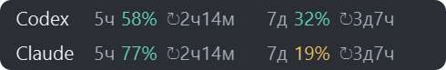
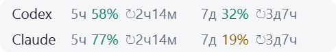
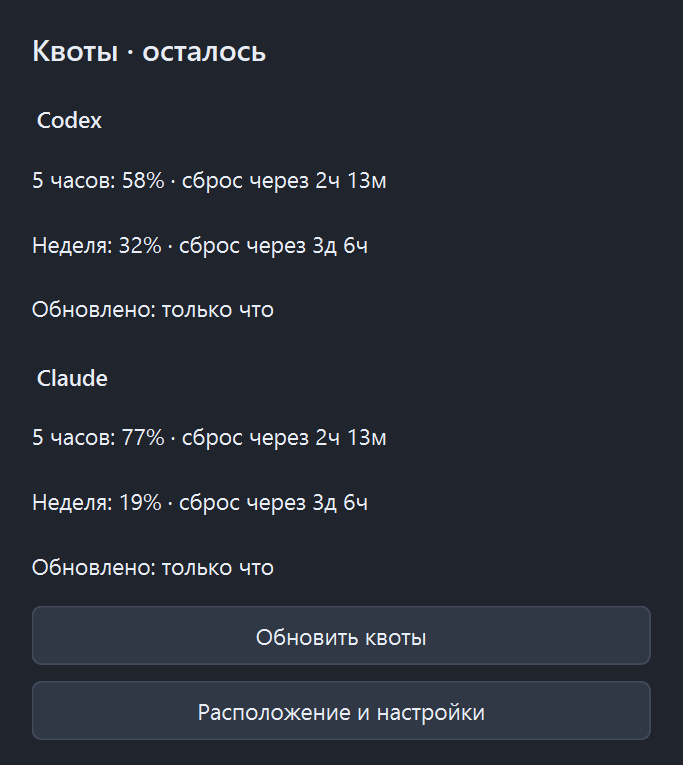

# QuotaPanel

**Оставшиеся квоты Codex и Claude — слева на панели задач Windows.**

QuotaPanel занимает свободное место слева от кнопок по центру: две строки,
по два лимита на сервис и отсчёт до сброса рядом с каждым процентом.
Нажмите на панель, чтобы открыть подробности.

## Как выглядит

Тёмная тема:



Светлая тема:



<details>
<summary>Окно подробностей</summary>

<p></p>

</details>

На скриншотах — демонстрационные данные. `5ч` и `7д` обозначают окна лимитов,
процент — **сколько осталось**, а `↻2ч14м` — время до следующего сброса.
Сброс одного окна не означает сброс другого.

## Что умеет

- Показывает оставшиеся пятичасовые и недельные лимиты Codex и Claude.
- Подстраивает светлую или тёмную тему под панель задач Windows.
- Обновляет квоты каждые 5 минут; доступно ручное обновление.
- Сохраняет последние полученные квоты на случай ошибки сети и отмечает их точкой.
- Позволяет настроить ширину и отступ, скрыть панель и включить автозапуск через трей.
- Скрывается при полноэкранном приложении и восстанавливает положение после перезапуска Explorer.

Если квота недоступна, вместо вымышленного значения выводится прочерк или
пояснение. В окне подробностей также видны дополнительные лимиты,
если сервис их возвращает.

## Перед запуском

Текущая версия — прототип для **Windows 11**, основной нижней панели задач
и кнопок, выровненных по центру. Войдите в Codex и Claude Code на этом компьютере.
Входа только на сайт Claude недостаточно.

| Сервис | Откуда берётся существующий вход |
| --- | --- |
| Codex | `%USERPROFILE%\.codex\auth.json`; учитывается `CODEX_HOME` |
| Claude Code | `%USERPROFILE%\.claude\.credentials.json` |

Если слева отображается погода, отключите «Мини-приложения» в
**Параметры → Персонализация → Панель задач**.

## Запуск из исходников

Нужны Python 3.11 или новее и [uv](https://docs.astral.sh/uv/).

```powershell
git clone https://github.com/sokoloff-rv/quotapanel.git
cd quotapanel
uv sync --locked
uv run quota-panel
```

Для знакомства без чтения файлов входа и запросов к сервисам:

```powershell
uv run quota-panel --demo
```

Для сборки приложения, которому не нужна установленная копия Python:

```powershell
uv run pyinstaller --noconfirm packaging/quotapanel.windows.spec
```

Запустите `dist/QuotaPanel/QuotaPanel.exe`. При переносе или упаковке копируйте
**всю папку** `dist/QuotaPanel`: каталог `_internal` должен оставаться рядом
с исполняемым файлом. Включите в распространяемый архив файл [LICENSE](LICENSE).
Сборка пока не подписана цифровой подписью.

## Управление

| Действие | Результат |
| --- | --- |
| Левый клик по панели | Оставшиеся лимиты, время до сброса и состояние обновления |
| Правый клик по панели | Обновление и настройки расположения |
| Клик по значку в трее | Окно подробностей |
| Правый клик по значку в трее | Расположение, автозапуск, показ/скрытие и выход |

Автозапуск выключен по умолчанию. Ширина и отступ сохраняются между запусками.

## Данные и подключение

QuotaPanel использует существующие файлы входа и запрашивает квоты напрямую
по HTTPS у `chatgpt.com` и `api.anthropic.com`. Собственного сервера нет.
Приложение не предлагает вводить API-ключи, не обновляет токены и не меняет
файлы входа. Токены не копируются в настройки или кеш; журналы скрывают секреты.
Если вход истёк, войдите заново в соответствующий инструмент.

| Путь | Содержимое |
| --- | --- |
| `%LOCALAPPDATA%\QuotaPanel\settings.json` | Настройки панели |
| `%LOCALAPPDATA%\QuotaPanel\last_good.json` | Последние полученные квоты |
| `%LOCALAPPDATA%\QuotaPanel\Logs\quotapanel.log` | Журнал работы |

Для удаления отключите автозапуск, выйдите из QuotaPanel и удалите папку приложения.
При необходимости отдельно удалите его локальные настройки и кеш.

## Ограничения

Панель — отдельное окно поверх свободной области панели задач. Она не внедряется
в Explorer и не является системным мини-приложением Windows.

- Место не резервируется: если кнопки приложений приблизятся к панели, уменьшите её ширину.
- При выравнивании кнопок слева панель скрывается, чтобы не перекрывать «Пуск».
- Поддерживается основная панель задач; вывода на все мониторы одновременно нет.
- При автоскрытии QuotaPanel появляется над открытой панелью задач. Эта поддержка предварительная.
- Работа с реальными аккаунтами и все варианты автоскрытия пока не проверялись.

Отрисовка обеих тем, геометрия Windows 11 и запуск собранного приложения проверены.
Подробные сведения о прототипе — в [QUOTAPANEL.md](QUOTAPANEL.md).

## Разработка

```powershell
uv run ruff check src tests
uv run pytest -q
uv run pytest -q --cov=src/quotabubble --cov-report=term-missing
```

Основная ветка — `master`. Изменения вносятся через отдельные ветки и pull request;
правила работы — в [AGENTS.md](AGENTS.md). Минимальное покрытие в CI — 80%.

В исходниках сохраняется имя Python-пакета `quotabubble` и код исходного приложения.
Точка входа QuotaPanel — `quota-panel`, Windows-сборка — `quotapanel.windows.spec`.

## Происхождение и лицензия

QuotaPanel основан на [QuotaBubble](https://github.com/izzet/quotabubble)
автора Izzet Yildirim. Из исходного проекта используются провайдеры квот
и часть инфраструктуры; интерфейс QuotaPanel создан для панели задач Windows.

[MIT](LICENSE). Исходная лицензия и уведомление об авторских правах сохранены;
их нужно включать при распространении копий и изменённых версий.
